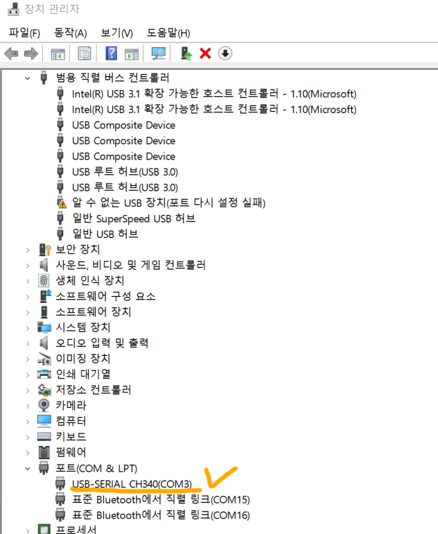
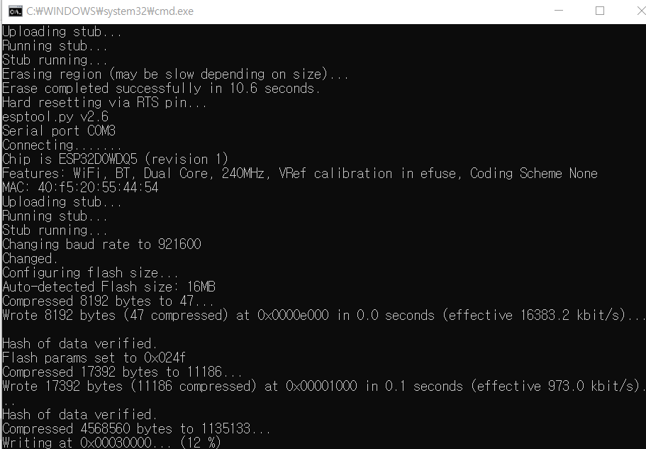

# update_popsign_bin

바이너리를 업데이트를 위한 Batch파일

### 사용방법

- CH341SER.ZIP 파일 압축 해제 후 SETUP.EXE 파일 실행한 후 INSTALL 버튼을 클릭하여 드라이버를 설치한다.

- 해당 프로젝트를 다운받은 후 포트를 연결시킨다.

- comport.txt파일에 PC에 연결된 popsign의 포트번호를 입력한다.
(포트번호는 제어판 > 장지 관리자 > 포트 에서 확인 가능하다.)

- update.bat을 실행한다. 

- 아래와 같이 업데이트가 진행된다.

